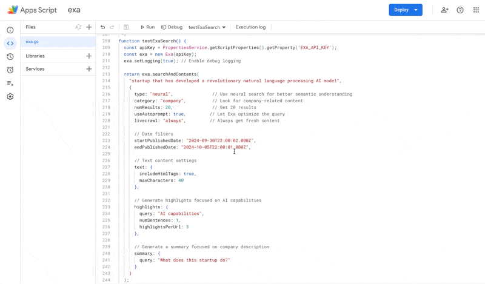

# Exa.ai for Google Apps Script

[](https://opensource.org/licenses/MIT)

An unofficial Google Apps Script client for the Exa.ai API. This library provides a simple way to use Exa.ai's semantic search capabilities directly in Google Apps Script projects.



## 🌟 Features

- Full compatibility with Exa.ai API
- Similar interface to the official `exa-js` npm package
- Easy integration with Google Apps Script
- Support for all Exa.ai search types and filters
- Detailed logging for debugging
- Comprehensive documentation and examples

## 📋 Prerequisites

1. An Exa.ai account and API key ([Get one here](https://exa.ai))
2. Access to Google Apps Script ([script.google.com](https://script.google.com))

## 🚀 Quick Start

1. Open your Google Apps Script project
2. Copy the contents of `exa.gs` into your project
3. Set up your Exa.ai API key in Script Properties:
   - Go to File -> Project Settings -> Script Properties
   - Add a new property with:
     - Name: `EXA_API_KEY`
     - Value: Your Exa.ai API key
4. Use the library in your project:

```javascript
function searchNews() {
  const exa = new Exa(PropertiesService.getScriptProperties().getProperty('EXA_API_KEY'));
  const results = exa.searchAndContents("Latest AI developments", {
    category: "news_article",
    numResults: 5
  });
  return results;
}
```

## 📖 API Documentation

### Creating an Exa Client

```javascript
const exa = new Exa(apiKey);
exa.setLogging(true); // Optional: Enable debug logging
```

### Search Methods

#### `searchAndContents(query, options)`

Searches for content and returns results with full text and summaries.

**Parameters:**

- `query` (string): The search query
- `options` (object): Search configuration

**Available Options:**

```javascript
{
  // Search Type
  type: "neural" | "keyword" | "auto",  // Default: "neural"
  
  // Content Category
  category: "company" | "research_paper" | "news_article" | "pdf" | 
           "github" | "tweet" | "movie" | "song" | "personal_site",
  
  // Basic Options
  useAutoprompt: boolean,     // Default: true
  numResults: number,         // Default: 10
  livecrawl: "always" | "fallback",
  
  // Domain Filters
  includeDomains: string[],   // e.g., ["example.com"]
  excludeDomains: string[],   // e.g., ["spam.com"]
  
  // Date Filters (ISO format)
  startPublishedDate: string, // e.g., "2024-01-01T00:00:00.000Z"
  endPublishedDate: string,
  startCrawlDate: string,
  endCrawlDate: string,
  
  // Text Content Options
  text: {
    includeHtmlTags: boolean,
    maxCharacters: number
  },
  
  // Highlight Options
  highlights: {
    query: string,
    numSentences: number,    
    highlightsPerUrl: number 
  },
  
  // Summary Options
  summary: {
    query: string
  }
}
```

**Response Structure:**

```javascript
{
  requestId: string,
  resolvedSearchType: string,
  results: [{
    score: number,
    title: string,
    url: string,
    publishedDate: string,
    author: string,
    text: string,
    summary: string,
    highlights: string[],
    highlightScores: number[],
    image?: string
  }]
}
```

## 📝 Examples

### Simple News Search

```javascript
function searchNews() {
  const exa = new Exa(PropertiesService.getScriptProperties().getProperty('EXA_API_KEY'));
  
  return exa.searchAndContents("AI news", {
    category: "news_article",
    numResults: 5
  });
}
```

### Advanced Company Search

```javascript
function searchAICompanies() {
  const exa = new Exa(PropertiesService.getScriptProperties().getProperty('EXA_API_KEY'));
  
  return exa.searchAndContents(
    "innovative AI startups in natural language processing",
    {
      type: "neural",
      category: "company",
      numResults: 20,
      startPublishedDate: "2024-01-01T00:00:00.000Z",
      text: {
        maxCharacters: 1000
      },
      highlights: {
        query: "AI capabilities and innovations",
        numSentences: 2
      },
      summary: {
        query: "What are their main AI products and innovations?"
      }
    }
  );
}
```

## 🤝 Contributing

Contributions are welcome! Please feel free to submit a Pull Request.

## 📄 License

This project is licensed under the MIT License - see the [LICENSE](LICENSE) file for details.

## 🙏 Acknowledgments

- Thanks to [Exa.ai](https://exa.ai) for their excellent API
- Built for the Google Apps Script community
